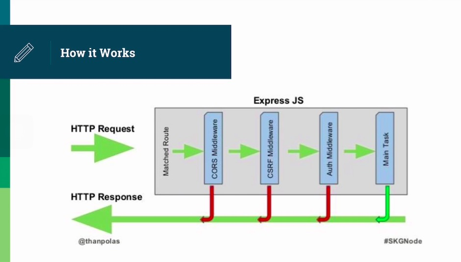
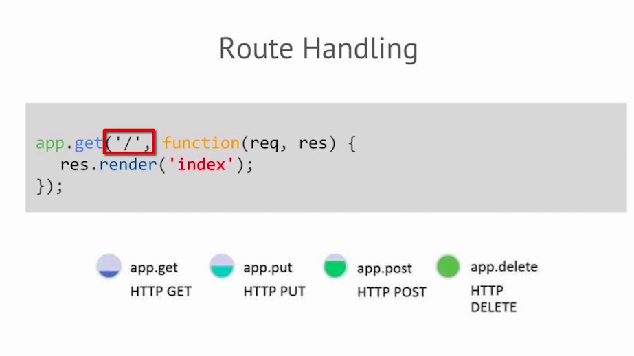
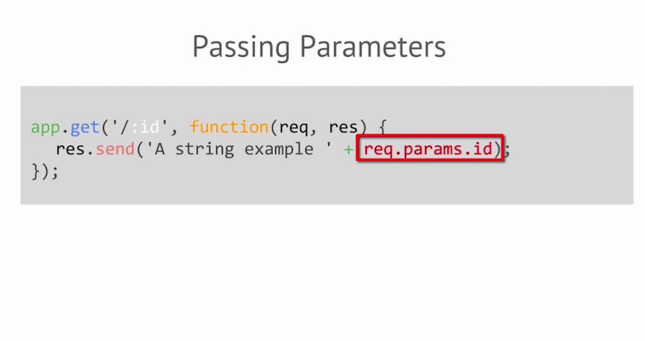
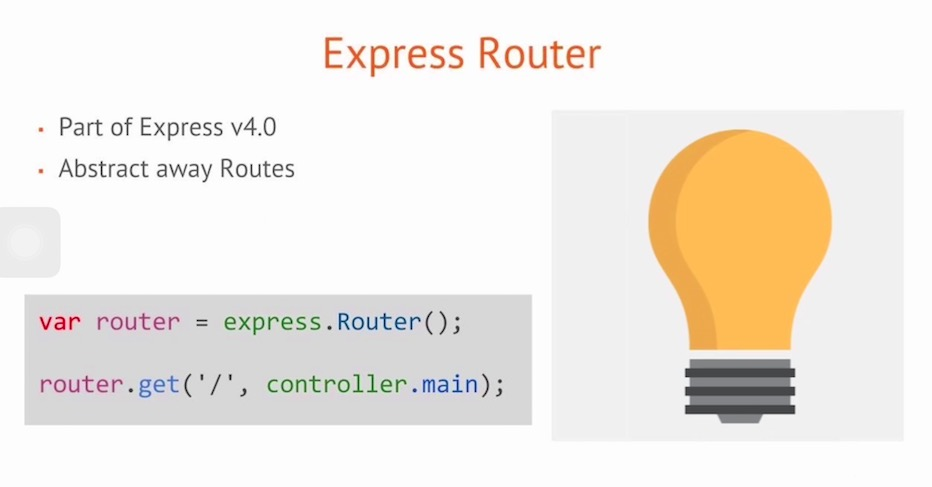

## What is express and why use it?
+ Ultra Fast I/O
+ Deal with requests
+ Routing made easy

## Basic Setup

+ Installation
+ npm install express -g
+ npm install express-generator -g
+ express Scaffolding
+ Jade
+ Middleware
+ Use express to generate a web app
+ Pay attention to routes and how express seprate the code into modules
+ npm start to run the app

## Server Setup

+ app.listen(port)
+ npm start vs node app (npm start is running the script in package.json)
+ nodemon app (when there's a change in your file, restart the server)
+ asynchronous node (callback functions passing around)


## Order and packages

+ order in app.js (it matters a lot)
+ middleware (very important concept, a lots of them sitting in the route, you can have your own middleware)
+ bundled packages
+ routing (You can seperate your routing, express has route API)

## middleware

**Any number of functions that are invoked by the Express.js routing layer before your final request handler is made**




## Templating

+ Template Setup
+ view files
+ Jade, EJS...

```
app.set('views',path.join(__dirname, 'views'));
app.set('view engine','jade');

```








